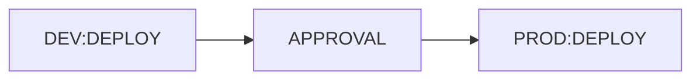
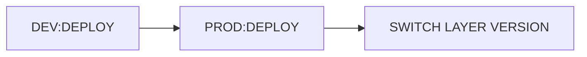

| | |
|--|--|
| | |

##  Lambda Functions & Stack Repo/CICD Rules:

-  **repo name(s):** loyalty-ops-foundation

>  **Number of branches:  1 - main/master**
Temporary branches branched off main/master
Developers work off temporary branches
Temporary branches merge back into main/master

>  **Branch protection**
1 approval required.
To prevent accidental merges into main/master branch enable "Required pull request reviews before merging" and "include administrators".

>  **Pipeline Trigger**
When working branch is merged into main/master branch
Temporary branches merge back into master



- The approval would be a break in the pipeline, acceptance would resume ci/cd process.

## Lambda Layer Repo/CICD Rules:

-  **repo name(s):** loyalty-ops-layer-config, loyalty-ops-layer-utilities, loyalty-ops-layer-modules

>  **Number of branches: 1 - main/master**
Temporary branches branched off main/master
Developers work off temporary branches
Temporary branches merge back into main/master

>  **Branch protection**
No approval required.
To prevent accidental merges into main/master branch enable "Required pull request reviews before merging" and "include administrators".

>  **Pipeline Trigger**
When working branch is merged into main/master branch
Temporary branches merge back into master

  

- Switch layer is a command ran by the developer/admin/manager
<br><br/>

| | |
|--|--|
| | |
## VSC Plugins installed

|Plugin |URL |
|-------------------------------|-----------------------------|
|`Ctrl-semicolon` |[plugin info](https://marketplace.visualstudio.com/items?itemName=Gforcedev.ctrl-semicolon) |
|`Docker` |[plugin info](https://marketplace.visualstudio.com/items?itemName=temName=ms-azuretools.vscode-docker) |
|`ESLint` |[plugin info](https://marketplace.visualstudio.com/items?itemName=dbaeumer.vscode-eslint) |
|`Git History` |[plugin info](https://marketplace.visualstudio.com/items?donjayamanne.githistory) |
|`Markdown` |[plugin info](https://marketplace.visualstudio.com/items?yzhang.markdown-all-in-one) |
|`Prophet Debugger ` |[plugin info](https://marketplace.visualstudio.com/items?itemName=SqrTT.prophet) |

 
<br><br/>
| | |
|--|--|
| | |
# Loyalty Operation Cheatsheet.

### AWS Cloudformaion samples

CloudFormation deploy pipeline
```sh
aws cloudformation deploy \
--stack-name github-aws-cicd \
--template-file pipeline.yml \
--capabilities CAPABILITY_IAM \
--parameter-overrides GitHubRepository=github-aws-cicd
```

CloudFormation deploy pipeline
```sh
aws cloudformation deploy \
--stack-name github-aws-cicd2 \
--template-file pipeline-multiple-sources.yml \
--capabilities CAPABILITY_IAM \
--parameter-overrides GitHubFoundationRepository=loyalty-ops-foundation \
GitHubModulesLayerRepository=loyalty-ops-layer-modules \
GitHubConfigLayerRepository=loyalty-ops-layer-config \
GitHubUtilitiesLayerRepository=loyalty-ops-layer-utilities
```

### AWS Lambda samples
Lambda::Layer: publish new version of existing layer
```sh
aws lambda publish-layer-version \
--layer-name loyalty-ops-configurations \
--description "Digital operation's configurations." \
--content S3Bucket=${ARTIFACT_BUCKET},S3Key=layer_config.zip \
--compatible-runtimes nodejs16.x
```

Lambda::Layer: get list of layers
```sh
aws lambda list-layers
```

Lambda: associate layers version to lambda function
```sh
aws lambda update-function-configuration \
--function-name loyalty-ops-reports-dev \
--layers \
arn:aws:lambda:us-west-1:343224624564:layer:loyalty-ops-config-dev:10 \
arn:aws:lambda:us-west-1:343224624564:layer:loyalty-ops-modules-dev:1 \
arn:aws:lambda:us-west-1:343224624564:layer:loyalty-ops-utilities-dev:2
```

### AWS SAM samples
Get list of lambda functions to invoke
```sh
sam local invoke
```

Invoke ReportGenerateFunction locally passing sample event
```sh
sam local invoke "PurchaseRegistrationReportGenerateFunction" -e ./events/skx-us-purchase-registration-report-generate.json
```

### Docker sample cmds
List images in local repo
```sh
docker image ls
```

List of running container
```sh
docker container ls
```
  
### Git cmds

Happy scenario workflow. It's best practice to start with a git status to check which branch you're in and to check if there's any pending change. If no pending go with happy workflow if you already have changes done stash it (see below), pull latest changes from main/master, apply stash, commit and push back to origin.
```sh
git status
git pull origin main
# make your changes and/or apply your stashed change #
git add .
git commit -am "your commit message here"
git push origin main
```

If you realize you've done work to your local branch and don't what to loose it. **Stash it!** When you want to undo work on a branch to refresh stash your change, apply your changes and apply stashed change to your branch.
```sh
git stash
git stash list
# pull from origin #
git stash apply
```

#### Getting & Creating Projects
| Command | Description |
| ------- | ----------- |
| `git init` | Initialize a local Git repository |
| `git clone ssh://git@github.com/[username]/[repository-name].git` | Create a local copy of a remote repository |

#### Basic Snapshotting
| Command | Description |
| ------- | ----------- |
| `git status` | Check status |
| `git add [file-name.txt]` | Add a file to the staging area |
| `git add -A` | Add all new and changed files to the staging area |
| `git commit -m "[commit message]"` | Commit changes |
| `git rm -r [file-name.txt]` | Remove a file (or folder) |

#### Branching & Merging
| Command | Description |
| ------- | ----------- |
| `git branch` | List branches (the asterisk denotes the current branch) |
| `git branch -a` | List all branches (local and remote) |
| `git branch [branch name]` | Create a new branch |
| `git branch -d [branch name]` | Delete a branch |
| `git push origin --delete [branch name]` | Delete a remote branch |
| `git checkout -b [branch name]` | Create a new branch and switch to it |
| `git checkout -b [branch name] origin/[branch name]` | Clone a remote branch and switch to it |
| `git branch -m [old branch name] [new branch name]` | Rename a local branch |
| `git checkout [branch name]` | Switch to a branch |
| `git checkout -` | Switch to the branch last checked out |
| `git checkout -- [file-name.txt]` | Discard changes to a file |
| `git merge [branch name]` | Merge a branch into the active branch |
| `git merge [source branch] [target branch]` | Merge a branch into a target branch |
| `git stash` | Stash changes in a dirty working directory |
| `git stash clear` | Remove all stashed entries |

#### Sharing & Updating Projects
| Command | Description |
| ------- | ----------- |
| `git push origin [branch name]` | Push a branch to your remote repository |
| `git push -u origin [branch name]` | Push changes to remote repository (and remember the branch) |
| `git push` | Push changes to remote repository (remembered branch) |
| `git push origin --delete [branch name]` | Delete a remote branch |
| `git pull` | Update local repository to the newest commit |
| `git pull origin [branch name]` | Pull changes from remote repository |
| `git remote add origin ssh://git@github.com/[username]/[repository-name].git` | Add a remote repository |
| `git remote set-url origin ssh://git@github.com/[username]/[repository-name].git` | Set a repository's origin branch to SSH |

#### Inspection & Comparison
| Command | Description |
| ------- | ----------- |
| `git log` | View changes |
| `git log --summary` | View changes (detailed) |
| `git log --oneline` | View changes (briefly) |
| `git diff [source branch] [target branch]` | Preview changes before merging |

